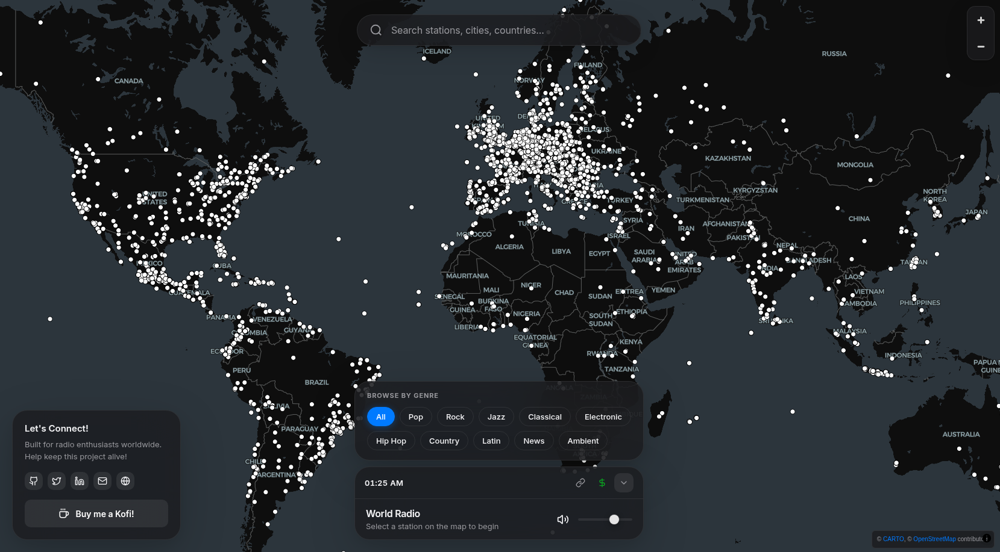

# 🌍 World Radio

An interactive web-based radio player that lets you explore and listen to thousands of radio stations from around the world on a beautiful interactive map.



## ✨ Features

- **Interactive Global Map** — Browse 5,000+ radio stations plotted on a beautiful dark/light themed map powered by MapLibre GL
- **Smart Search** — Find stations by name, city, country, or tags with real-time filtering
- **Genre Filtering** — Browse stations by genre: Pop, Rock, Jazz, Classical, Electronic, Hip Hop, Country, Latin, News, and Ambient
- **Progressive Loading** — Fast initial load with stations loading in batches (500 → 1,000 → 3,000 → 5,000)
- **Shareable Links** — Copy a direct link to any station and share it with friends
- **Smart Caching** — Station data cached locally for instant subsequent loads
- **Dynamic Favicon** — Tab icon and title update to show the currently playing station
- **Responsive Design** — Works seamlessly on desktop and mobile devices
- **Dark Mode** — Beautiful dark theme by default with light mode support

## 🚀 Quick Start

### Prerequisites

- Node.js 18+ 
- pnpm (recommended) or npm

### Installation

```bash
# Clone the repository
git clone https://github.com/yourusername/worldradio.git
cd worldradio

# Install dependencies
pnpm install

# Start development server
pnpm dev
```

The app will be available at `http://localhost:5173`

### Build for Production

```bash
# Build the project
pnpm build

# Preview the production build
pnpm preview
```

## 🛠️ Tech Stack

- **Framework:** [React 19](https://react.dev/) with TypeScript
- **Build Tool:** [Vite 7](https://vite.dev/)
- **Mapping:** [MapLibre GL](https://maplibre.org/) with Carto basemaps
- **Icons:** [Lucide React](https://lucide.dev/)
- **Notifications:** [React Hot Toast](https://react-hot-toast.com/)
- **API:** [Radio Browser API](https://www.radio-browser.info/)

## 📁 Project Structure

```
worldradio/
├── public/              # Static assets
├── src/
│   ├── components/      # React components
│   │   ├── AudioWave.tsx    # Audio visualization
│   │   ├── RadioMap.tsx     # Interactive map
│   │   ├── RadioPlayer.tsx  # Player controls
│   │   ├── SearchBar.tsx    # Station search
│   │   └── SocialFloat.tsx  # Social links panel
│   ├── hooks/           # Custom React hooks
│   │   ├── useAudioPlayer.ts    # Audio playback logic
│   │   ├── useCloudflare.ts     # Analytics integration
│   │   └── useRadioStations.ts  # Station data fetching
│   ├── types/           # TypeScript types
│   │   └── radio.ts     # Radio station types & genres
│   ├── App.tsx          # Main application
│   ├── App.css          # Application styles
│   └── main.tsx         # Entry point
├── index.html           # HTML template
├── vite.config.ts       # Vite configuration
└── package.json
```

## 🔧 Environment Variables

Create a `.env` file in the root directory for social links configuration:

```env
VITE_GITHUB_URL=https://github.com/yourusername
VITE_TWITTER_URL=https://twitter.com/yourusername
VITE_LINKEDIN_URL=https://linkedin.com/in/yourusername
VITE_EMAIL_URL=your@email.com
VITE_WEBSITE_URL=https://yourwebsite.com
VITE_KOFI_URL=https://ko-fi.com/yourusername
```

## 🎵 How It Works

1. **Data Source:** Stations are fetched from the [Radio Browser API](https://api.radio-browser.info/), which provides metadata for thousands of internet radio stations worldwide.

2. **Progressive Loading:** The app loads stations in batches to ensure a fast initial experience:
   - First 500 stations load immediately
   - Additional batches load in the background
   - Data is cached in localStorage for 30 minutes

3. **Map Rendering:** Stations with geo-coordinates are rendered as interactive points on the map using MapLibre GL with GeoJSON data sources.

4. **Audio Playback:** The Web Audio API is used for playback with an AnalyserNode for potential audio visualization.

## 🔗 Deep Linking

Share any station by copying its unique URL. The app supports the `station_uuid` query parameter:

```
https://worldradio.example.com/?station_uuid=abc-123-def
```

When someone opens this link, the station will automatically start playing once loaded.

## 📜 Available Scripts

| Command | Description |
|---------|-------------|
| `pnpm dev` | Start development server |
| `pnpm build` | Build for production |
| `pnpm preview` | Preview production build |
| `pnpm lint` | Run ESLint |
| `pnpm deploy` | Deploy to AWS (custom script) |

## 🌐 API Attribution

This project uses the free [Radio Browser API](https://www.radio-browser.info/) to fetch radio station data. The API is community-maintained and provides access to thousands of internet radio stations.

## 🤝 Contributing

Contributions are welcome! Please feel free to submit a Pull Request.

1. Fork the repository
2. Create your feature branch (`git checkout -b feature/amazing-feature`)
3. Commit your changes (`git commit -m 'Add some amazing feature'`)
4. Push to the branch (`git push origin feature/amazing-feature`)
5. Open a Pull Request

## 📄 License

This project is open source and available under the [MIT License](LICENSE).

## 💖 Support

If you enjoy using World Radio, consider supporting the project:

- ⭐ Star the repository
- ☕ [Buy me a coffee](https://ko-fi.com/macad626)
- 🐛 Report bugs and suggest features

---

<p align="center">
  Made with ❤️ for radio enthusiasts worldwide
</p>
